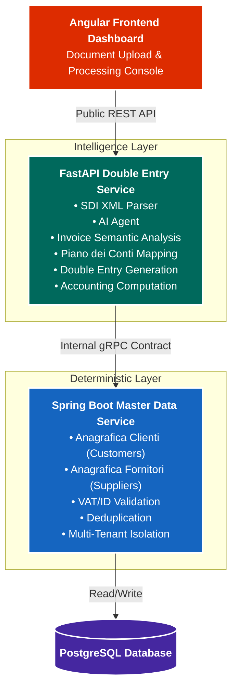
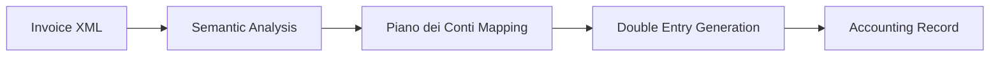

# SmartAccounting

## Project Overview

**LedgerGuard Registry & Document Engine** is a proof-of-concept architecture that combines Artificial Intelligence with deterministic enterprise services to automate invoice processing while preserving accounting data integrity.

The primary responsibility of the AI Agent is the **autonomous assignment of the Piano dei Conti (Chart of Accounts)** by understanding the semantic context of invoice descriptions. In addition, the agent determines whether a new **Anagrafica** (master data record) must be securely created, delegating all validation and consistency guarantees to a dedicated backend service.

The project demonstrates how probabilistic AI can safely coexist with deterministic business logic by separating responsibilities between an intelligent document-processing layer and a strongly validated master data service.

---

# 1. Problem Statement

## Domain Context

Italian B2B electronic invoices (*Fatture Elettroniche*) are exchanged through the **Sistema di Interscambio (SDI)** as structured XML documents.

Although these XML files contain detailed transactional information, they lack the semantic accounting information required by ERP systems. For example:

> "Manutenzione climatizzatori uffici terzo piano"

contains enough information for a human accountant to understand that the expense belongs to building maintenance, but no explicit accounting classification is provided.

Therefore, an accounting system must answer two fundamental questions:

1. **Which Chart of Accounts entry should this transaction use?**
2. **Does the supplier already exist in the company's master registry?**

---

## AI Agent Responsibilities

The AI Agent performs semantic analysis of the invoice content in order to:

- understand natural language descriptions;
- classify each expense into the appropriate **Piano dei Conti** account;
- identify supplier information;
- extract the supplier's **Partita IVA**;
- determine whether a new **Anagrafica** should be created.

Since AI predictions are probabilistic by nature, they must never directly modify enterprise master data.

---

## Business Challenge

Master data must remain deterministic, consistent, and legally valid.

Before creating a supplier, the system must ensure that:

- the supplier does not already exist;
- the VAT number is formally valid;
- tenant isolation is respected;
- duplicate or malicious records cannot enter the database.

This separation between intelligent inference and deterministic validation represents the core architectural principle of the project.

---

## 2. System Architecture

The system follows a **separation of responsibilities** approach, where AI-driven accounting interpretation is isolated from deterministic enterprise data management.

The architecture is composed of two backend services:

* **FastAPI Double Entry Service**: responsible for document processing, AI reasoning, accounting interpretation, and double-entry generation.
* **Spring Boot Master Data Service**: responsible strictly for managing and protecting **Anagrafica Clienti e Fornitori** (Customer and Supplier Master Data).

### Architecture Diagram



---

### FastAPI Double Entry Service
The FastAPI Double Entry Service represents the intelligent accounting engine of the platform.
Its responsibility is to transform raw electronic invoices into structured accounting operations.
The service receives SDI XML documents through a public REST API and performs the complete document analysis workflow:

1.  Parsing invoice XML content
2.  Extracting structured information
3.  Analyzing invoice descriptions through the AI Agent
4.  Identifying the accounting meaning of each document line
5.  Mapping expenses and revenues to the correct *Piano dei Conti* accounts
6.  Generating the corresponding double-entry accounting movements

The AI Agent is responsible for the semantic interpretation of invoice content.

**Example Interpretation:**
> **Raw Line:** *"Manutenzione climatizzatori uffici terzo piano"*
>
> **AI Output:**
> * **Debit:** Spese di Manutenzione Immobili
> * **Credit:** Debiti verso Fornitore

The final output of the service is a complete accounting proposal composed of document classification, account mapping, debit/credit movements, and accounting metadata. The service also extracts relevant business entities such as supplier information, customer information, Partita IVA, and company identifiers.

Whenever a customer or supplier must be created or verified, the service delegates this operation to the Spring Boot Master Data Service through a gRPC contract. **The AI layer never directly modifies Anagrafica records.**

---

### Spring Boot Master Data Service
The Spring Boot Master Data Service is the deterministic core responsible *exclusively* for managing **Anagrafica Clienti e Fornitori**. It represents the single source of truth strictly for:
* Customers (*Clienti*)
* Suppliers (*Fornitori*)
* Related identification information (VAT numbers, Tax Codes)

Unlike the FastAPI service, this component does not perform AI-based reasoning, nor does it manage other types of master data (e.g., products, chart of accounts). Its sole responsibility is guaranteeing data correctness and enforcing business rules for entities. For every request received from the Double Entry Service, it performs:
* Existence checks
* Duplicate detection
* VAT number validation
* Legal data consistency checks
* Controlled creation of new records

**Example Workflow:**
```text
[AI Agent detects supplier]
    ACME S.r.l. | VAT: 01234567890
              |
              | (gRPC Request)
              ▼
[Master Data Service]
    Does VAT already exist in Anagrafica Fornitori?
        ├── YES → Return existing supplier ID
        └── NO  → Validate data and create supplier
```
*This guarantees that AI-generated information cannot introduce inconsistent or duplicated Anagrafica records.*

---

## 3. Key Architectural Pillars

### Pillar 1 — AI-Driven Accounting Automation
The core innovation of the platform is the ability to transform unstructured invoice descriptions into accounting transactions. The AI Agent does not simply classify documents; it understands the business meaning behind invoice lines and produces a structured accounting interpretation.


*This enables automation of repetitive accounting activities while maintaining control over accounting rules and final data integrity.*

### Pillar 2 — Deterministic Master Data Protection
AI systems can generate predictions, but they cannot guarantee data consistency. For this reason, all customer and supplier operations are delegated to the Spring Boot Master Data Service.
The service guarantees:
* No duplicate customers or suppliers
* Valid identification data
* Consistent database state strictly for Anagrafiche
* Controlled creation of new entities

*The AI Agent proposes changes to Anagrafica, while the Master Data Service validates and applies them.*

### Pillar 3 — Multi-Tenant Isolation
The platform is designed to support multiple independent companies. Each request contains the tenant context through gRPC metadata (e.g., `tenant_id = COMPANY_A`).

The Master Data Service automatically applies tenant filtering:
```sql
SELECT * FROM suppliers WHERE tenant_id = :currentTenant;
```
*This architectural approach prevents accidental data leakage between different companies.*

### Pillar 4 — Explainable AI & Audit Trail
Every automated accounting decision is recorded. The audit system stores:
* Original invoice information & extracted entities
* AI confidence values
* Selected Piano dei Conti accounts
* Generated debit/credit movements
* Master data operations & timestamps

*This provides complete traceability and allows accountants to understand why a specific accounting decision was generated.*

**Audit Example:**
```yaml
Invoice:
  Description: "Server maintenance annual contract"
AI Decision:
  Account: "IT Services Expenses"
  Confidence: 94%
Generated Entry:
  Debit: "IT Services Expenses"
  Credit: "Supplier Payable"
```

---

## 4. Frontend Scope (Angular)
The Angular frontend acts as a demonstration console for the complete accounting workflow. The interface contains:

* **Document Upload Panel:** Allows uploading a sample SDI XML document or triggering a simulated invoice processing flow.
* **Tenant Selector:** Allows switching between different companies to demonstrate isolated environments, independent Anagrafiche, and multi-tenant architecture.
* **Processing Audit Console:** Displays the complete execution pipeline.

**Audit Console Pipeline:**
> SDI XML Received ➔ Invoice Parsed ➔ AI Analysis Completed ➔ Chart of Accounts Assigned ➔ Double Entry Generated ➔ Customer/Supplier Verified ➔ Accounting Document Completed

The user can inspect every step and understand how AI and backend services collaborate.

---

## 5. Deployment Architecture
The deployment is designed to minimize cloud costs while maintaining a production-like architecture.

### Infrastructure Provisioning
Terraform creates:
* AWS VPC & Public Subnet
* EC2 Security Group
* Free-tier EC2 instance (t2.micro or t3.micro)

### Application Deployment
All services run inside Docker containers on the EC2 Instance:
```text
┌──────────────────────────────────────┐
│ Docker Compose Engine                │
│                                      │
│  [ Angular + Nginx ]                 │
│  [ FastAPI Double Entry Service ]    │
│  [ Spring Boot Master Data ]         │
│  [ PostgreSQL ]                      │
└──────────────────────────────────────┘
```
The EC2 instance is automatically initialized through a startup script (`user-data`) that installs Docker, downloads the application, starts the containers, and configures the environment. This provides a reproducible and low-cost deployment strategy.

---

## 6. Technology Stack

| Layer | Technology |
| :--- | :--- |
| **Frontend** | Angular |
| **AI Accounting Engine** | Python + FastAPI |
| **AI Integration** | LLM-based Agent |
| **Internal Communication** | gRPC + Protocol Buffers |
| **Master Data Backend** | Spring Boot |
| **Database** | PostgreSQL |
| **Containerization** | Docker Compose |
| **Infrastructure as Code** | Terraform |
| **Cloud Platform** | AWS Free Tier |

---

## 🎯 Architectural Principle
The system is built around a fundamental principle:

> **AI interprets business meaning, while deterministic services guarantee enterprise reliability.**

The **FastAPI Double Entry Service** provides intelligence, document understanding, and accounting automation. The **Spring Boot Master Data Service** provides consistency, validation, and protection exclusively for **Anagrafica Clienti e Fornitori**. Together, they create an AI-assisted accounting platform that combines automation with enterprise-grade reliability.